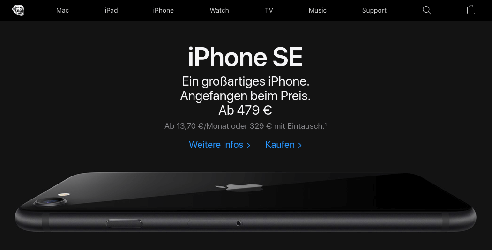
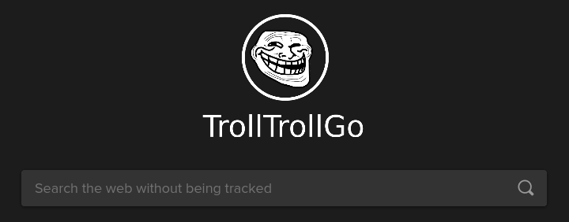
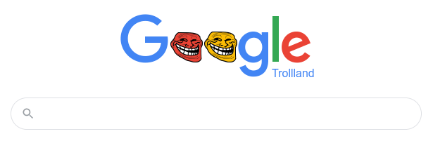
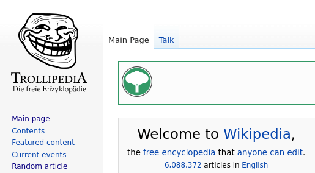

# Troll'em
Adds a trollface or trolltext to some large websites.

## Installation
For use with [Greasemonkey](https://addons.mozilla.org/de/firefox/addon/greasemonkey/) (Firefox) or [Tampermonkey](https://chrome.google.com/webstore/detail/tampermonkey/dhdgffkkebhmkfjojejmpbldmpobfkfo) (Chrome).

Click this link: <https://github.com/dargmuesli/troll-em/raw/master/troll-em.user.js>

## Greasy Fork
Visit this script's home at: <https://greasyfork.org/de/scripts/17608-troll-em>

## Example Screenshots

### Apple

### Bing

### DuckDuckGo

### Google

### Netflix

### Wikipedia
